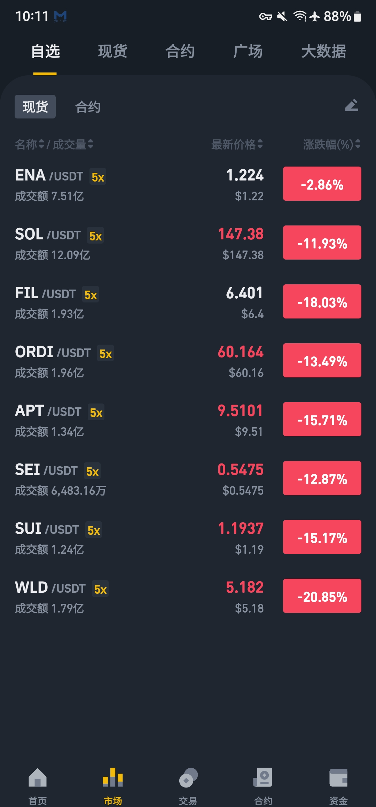

# 坚持定投10年不动摇

## [APT](https://github.com/aptos-labs/aptos-core)
- [home](https://aptosfoundation.org)
- [APT节点质押](https://explorer.aptoslabs.com/transactions?network=mainnet&type=user) [质押教程](https://cloud.tencent.com/developer/news/1117561)

### [LME](https://legendaryme.me/) 
```
apt链第一个meme
总量: 1000 亿
持仓目标: 1亿


2024-03-26
持仓 748.5万
价格 0.00001212 U

2024-03-28
持仓 1200+万

2024-04-05
持仓 钱包A 1200+万  钱包B 1000+万
价格 0.00000677 U

2024-04-14
持仓 钱包A 1200+万  钱包B 1000+万 抹茶交易所 1550+万
价格 0.000006385 U
```


## [SUI](https://github.com/MystenLabs/sui)
- [home](https://sui.io)
- [SUI 质押教程](https://www.theblockbeats.info/news/43857)

### [SCB](https://sacabam.fun) 
```
sui链第一个meme
总量: 47000 亿
持仓目标: 47亿

2024-03-22
燃烧总量 5625 亿
价格 0.0000000935 U

2024-03-23
持仓 28亿 223U

2024-03-28
持仓 30亿

2024-04-05
持仓 钱包A 30亿 抹茶交易所 3亿
价格 0.0000000545 U

2024-04-14
持仓 钱包A 30亿 抹茶交易所 15.8亿
价格 0.00000003247 U
```

## [SEI](https://github.com/sei-protocol/sei-chain)
- [home](https://www.sei.io)
- [SEI 质押](https://app.sei.io/stake?tab=allValidators)


## [WLD](https://github.com/worldcoin) 2027-01-01 左右再抄底 或 看价格寻机抄底
- [home](https://worldcoin.org)
```
WLD总量100亿，目前已解锁将近1.2%。
每日线性解锁312万，直到2024年7月24日开始每日解锁662万。

其代币模型如下:
TFH投资者  9亿5千万枚 这些代币锁定12个月，然后在接下来的24个月内每天平均解锁。
TFH储备 2亿枚 在发布后锁定12个月，然后在接下来的24个月内每天平均解锁。
初始开发团队 13.5亿枚 在发布后锁定12个月，然后在接下来的24个月内每天平均解锁。
Worldcoin社区 75亿

发布时：5亿
发布到第三年年底：40亿  2026-12-30
第4年开始到第6年结束：57亿5千万 
第7年开始到第9年结束：66亿2千5百万
第10年开始到第15年结束：75亿 
```

### 2024-03-16
```
APT: 15.44U
SUI: 1.69U
SEI: 1.07U
WLD: 9.33U 用户：433+万
```

### 2024-03-19
```
APT: 14.25U
SUI: 1.47U
SEI: 0.79U
WLD: 7.98U 用户：439+万
```

### 2024-03-20
```
APT: 14.86U
SUI: 1.61U
SEI: 0.82U
WLD: 7.83U 用户：443+万
```

### 2024-03-21
```
APT: 15.60U  commit: 20500  hold: 180
SUI: 1.85U  commit: 12307  hold: 1282
SEI: 0.87U  commit: 857  hold: 3609
WLD: 8.37U 用户：445+万 hold: 0
```

### 2024-03-23
```
APT: 15.55U
SUI: 1.70U
SEI: 0.80U
WLD: 8.10U 用户：450+万
```

### 2024-03-27
```
APT: 18.70U   commit: 20542   Contributors: 484
SUI: 1.91U   commit: 12375   Contributors: 273
SEI: 0.84U   commit: 861   Contributors: 31
WLD: 8.86U 用户：459.3+ 万
```

### 2024-04-05
```
APT: 13.05U   commit: 20592   Contributors: 485
SUI: 1.60U   commit: 12471   Contributors: 278
SEI: 0.70U   commit: 862   Contributors: 31
WLD: 6.80U 用户：479.1+ 万
```
### 2024-04-11
```
APT: 12.16U   commit: 20620   Contributors: 485  hold: 650
SUI: 1.51U   commit: 12504   Contributors: 278  hold: 2700
SEI: 0.66U   commit: 862   Contributors: 31  hold: 3617
WLD: 6.50U 用户：490.4+ 万  hold: 0
```

### 2024-04-13
```
抄底 3200 u
剩余 6300 u ，后面再抄底
```



### 2024-04-14
```
今日依旧暴跌
已全部梭哈
APT: 9.05U   hold: 1210
SUI: 1.11U   hold: 3700
SEI: 0.50U   hold: 3620
WLD: 4.67U 用户：496+万 hold: 0
W: 0.58U   hold: 5000
```

### 2024-04-16
```
大跌
APT:  commit: 20662   Contributors: 491
SUI:  commit: 12534   Contributors: 280
SEI:  commit: 863   Contributors: 31
W:   commit: 3654  Contributors: 81
WLD:  用户：498.1+ 万
```
